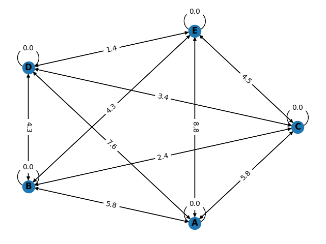

# Path Optimization Algorithms

Sometime ago, while I was coming back from college, I starting thinking about the path my bus takes to pass through each university. I was wondering, does it take the best path possible?



The relations between each university can be seen as graph. Each node corresponds to a single university and each edge distance between them.

My Bus, takes the path `A -> B -> C -> D -> E`, but is it the best one?

Well, to answer that I implement `5` algorithms for path optimization to check it.

## Classical

The first part of this project consists in `4` classical algorithms for this kind of problem, which are:

* greedy algorithm
* brute force
* Dijkstra
* Kruskal

They were implemented in `R` and can be found at: [classical.R](./classical/classical.R).

### Run Classical Version

To run the classical version, you must have installed:

* [R](https://www.r-project.org/)
* [make](https://www.gnu.org/software/make/) (optional)

if you're using whatever distro based on `Debian`, there's a setup script that install all the dependencies required to run these algorithms. To do that, run:

```bash
chmod +x setup-debian.sh
./setup-debian.sh
```

`Note: RStudio will also be installed in this process`

With all dependencies downloaded, run on your terminal:

```bash
cd ./classical
make install
make run

# or
cd ./classical
sudo Rscript ./installation.R
Rscript classical.R
```

as result, you must see something like this:

```bash
[1] "************************"
[1] "Running  Greedy  algorithm"
[1] "************************"
[1] "Path: "
[1] "A, B, C, D, E"
[1] "Total length:  13.1"
[1] "************************"
[1] "Running  Brute Force  algorithm"
[1] "************************"
[1] "Path: "
[1] "A, B, C, D, E"
[1] "Total length:  13.1"
[1] "************************"
[1] "Running  Dijkstra  algorithm"
[1] "************************"
[1] "Path: "
[1] "A, B, C, D, E"
[1] "Total length:  13.1"
[1] "************************"
[1] "Running  Kruskal  algorithm"
[1] "************************"
[1] "Path: "
[1] "A, B, C, D, E"
[1] "Total length:  13.1"
```

## Quantum Version

Finally, the problem was converted to quantum in format of a `QUBO` problem. This way, it was possible to minimize the path based on the binary relation between encoded variables.

To implement this version I used [Dimod](https://docs.ocean.dwavesys.com/en/stable/docs_dimod/) a python API from [D-Wave](https://www.dwavesys.com/) to interact with samplers and develop `QUBO` applications.

### The Formula

To encode this problem, first we have to clean the set of all edges from the graph, in this case we need to ignore those that either $W(e) = 0.0$ or its target node is the initial node $A$. The set of valid edges will be named as $E = \{AB, AC, AD, ..., ED\}$.

The first term of our `QUBO` implementation is: $\sum_{i=0}^{n}{E_{i}x_{i}}$, being $n$ the number of elements in $E$.

For this specific setup, 3 constraints are required:

1. only 4 nodes are going to be visited
2. only 1 node is visited at each step
3. loops are not created

the specific formulation for each one is respectively:

$P(\sum_{i=0}^{n}{x_i}-4)^2$

$P(\sum_{step=1}^{n_{steps}}(\sum_{i=0}^{n}{x_i}-1))^2$

$P(\sum_{target}(\sum_{relation_{target}}{x_i}-1))^2$ Where $target$ is the node and $relation$ is a joint of two nodes with the target node being the current $target$ factor in the summation.

Doing that, the final formulation is: 

$$\sum_{i=0}^{n}{E_{i}x_{i}} + P(\sum_{i=0}^{n}{x_i}-4)^2 + P(\sum_{step=1}^{n_{steps}}(\sum_{i=0}^{n}{x_i}-1))^2 + P(\sum_{target}(\sum_{relation_{target}}{x_i}-1))^2$$

Executing this with `Dimod` we have as result:

```bash
Path: AB BC CD DE 
Path size: 13.1
```

Being the same as the classical version, which is what we expected.

### Run Quantum Version


If you want to check it out, open the notebook [qubo-version](./qubo-version.ipynb) and also take a look at the exported results from the execution [results](https://github.com/Dpbm/optimization-path/releases/tag/qubo).

To run it you may have:

* [python 3.12](https://www.python.org/)
* [conda](https://anaconda.org/)/[mamba](https://mamba.readthedocs.io/)/[conda-lock](https://github.com/conda/conda-lock) (optional)

Then install the python dependencies:

```bash
# using pure conda/mamba
conda env create -f environment.yml
conda activate path-optimization

# using conda-lock
conda-lock install conda-lock.yml -n path-optimization
conda activate path-optimization

# using pip (remember to create a venv before)
pip install -r requirements.txt
```

Doing so, just type:

```bash
jupyter lab qubo-version.ipynb
```

and start playing with it.


## Miscellaneous

There's also a tiny script to build the graph you saw above. If you want to test it, feel free to check [build-graph.py](./build-graph.py).


## Final Thoughts

After finishing this project, it's possible to conclude that the bus was already taking the optimal path, traveling $13.1 Km$ in total.

